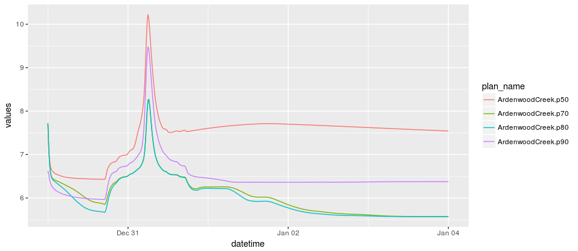

# hecr 

A simple R package for interacting with hdf5 files resulting from a HEC-RAS 
model run. `hecr` uses the `h5` package and wraps around it functions that enable 
a user to quickly query out desired data in a tidy dataframe format.

## Installation 

The install required `devtools`, install with `install.packages("devtools")`.
To install `hecr` do the following:

```r 
devtools::install_github("flowwest/hecr")
```

## Usage 

hecr can be used to query out either time series from a 1d or 2d portion of a 
model file. 

### One Dimension 

A user is required to know the river cross section name from the hdf file. This may
be a bit limiting at the moment, future releases will allow exploration of the 
file via R. A simple example is shown below:

```r
library(hecr)

# first read in the file
f <- hecr::hec_file("inst/raw-data/ArdenwoodCreek.p50.hdf")

# extract a one portion time series of Water Surface
water_surface <- hecr::extract_ts1(f, 6863.627, ts_type = "Water Surface")

# plot
water_surface %>% ggplot(aes(datetime, values, color = plan_name)) + geom_line()
```


The above is useful, the simple fact that data is transformed to a tidy format 
is great. However, much of this work could have been done in hecRas, the more powerful 
aspect of hecr is when start putting together complex queries. 

Here is an example where we create an hdf corpus of files we want to issue queries
on.

```r
# path to directory with hdf files we wish to query on
corp <- hecr::create_hdf_corpus("inst/raw-data/")

water_surface <- hecr::extract_ts1(corp, 6863.627, ts_type = "Water Surface")

# plot
water_surface %>% ggplot(aes(datetime, values, color = plan_name)) + geom_line()
```



Once again the data is in a tidy form, and so it works great with ggplot or plotly. 
Further more all of dplyr is at your disposal. 

## Two Dimensions

Much of the same can be done for two dimensional portions of model runs. Here we show 
the same examples above but this time getting time series for two dimension portions of
model files. 

*One HDF File* 

```r
# read in file
f <- hecr::hec_file("inst/raw-data/ArdenwoodCreek.p50.hdf")

# set up coordinate to query for
coord <- c(6103057.45033481, 2027049.43985547)

x <- hecr::extract_ts2(f, xy = coord, ts_type = "Water Surface")

print(x3)
```

```
# A tibble: 481 x 5
              datetime          plan_name time_series_type hdf_cell_index           values
                <dttm>              <chr>            <chr>          <dbl>            <dbl>
 1 2005-12-30 00:00:00 ArdenwoodCreek.p50    Water Surface          18296 6.66271018981934
 2 2005-12-30 00:15:00 ArdenwoodCreek.p50    Water Surface          18296 6.66538572311401
 3 2005-12-30 00:30:00 ArdenwoodCreek.p50    Water Surface          18296 6.66436624526978
 4 2005-12-30 00:45:00 ArdenwoodCreek.p50    Water Surface          18296 6.65778636932373
 5 2005-12-30 01:00:00 ArdenwoodCreek.p50    Water Surface          18296 6.64651870727539
 6 2005-12-30 01:15:00 ArdenwoodCreek.p50    Water Surface          18296 6.63137197494507
 7 2005-12-30 01:30:00 ArdenwoodCreek.p50    Water Surface          18296 6.61756515502930
 8 2005-12-30 01:45:00 ArdenwoodCreek.p50    Water Surface          18296 6.60669612884521
 9 2005-12-30 02:00:00 ArdenwoodCreek.p50    Water Surface          18296 6.59691762924194
10 2005-12-30 02:15:00 ArdenwoodCreek.p50    Water Surface          18296 6.58782863616943
# ... with 471 more rows
```

Plotting 

```r
x %>% ggplot(aes(datetime, values)) + geom_line()
```


