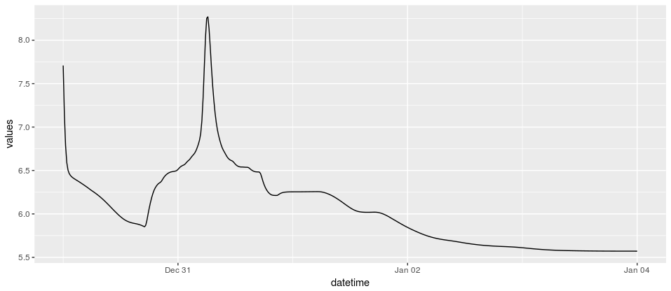

# hecr 

A simple R package for interacting with hdf5 files resulting from a HEC-RAS 
model run. `hecr` uses the `h5` package and wraps around it functions that enable 
a user to quickly query out desired data in a tidy dataframe format.

## Installation 

The install requires `devtools`, install with `install.packages("devtools")`.
To install `hecr`:

```r 
devtools::install_github("flowwest/hecr")
```

Installing hecr will install as dependencies: h5, dplyr, purrr and config. If detected
on the system these will not install, but an update might be required. Both purrr and dplyr
need to be in the latest version for hecr to work.

## Usage 

The main goal of hecr is to allow a user to obtain and automate to process
of obtaining time series data from an hdf file resulting from a HEC-RAS model run.
Hecr makes it easy to query data from an hdf by giving the user a consistent approach
to querying the data. The hecr package gives an interface for obtaining both 
cross section and 2d time series.

Below we walk through simple examples of queries, more complex examples and real world
applications can be found in the [Tutorial (Coming Soon)](#)

## One Dimension Queries


*One HDF File* 

A user is required to know the river cross section name from the hdf file. This may
be a bit limiting at the moment, and requires navigating to an application like ras-mapper,
future releases will address this issue. A simple example is shown below:

```r
# load in the library
library(hecr)

# first read in the file with the hec_file function
f <- hecr::hec_file("inst/raw-data/ArdenwoodCreek.p50.hdf")

# extract a cross section portion of the model using the extract_ts1
water_surface <- hecr::extract_ts1(f, 6863.627, ts_type = "Water Surface")

# plot
water_surface %>% ggplot(aes(datetime, values, color = plan_name)) + geom_line()
```



The above is useful, the simple fact that data is transformed to a tidy format 
is great. However, much of this work could have been done in HEC-RAS (through more steps), the more powerful 
aspect of hecr is when we start putting together complex queries and mixing and 
matching multiple files and cross sections (and later coordinates). 

*Multiple HDF Files*

Here is an example where we read in a collection of hdf files. We can do so with the 
same `hec_file()` function, but this time supply it a directory containing the hdf
files we are interested in.

```r
# path to directory with hdf files we wish to query on
f <- hecr::hec_file("inst/raw-data/")

water_surface <- hecr::extract_ts1(f, 6863.627, ts_type = "Water Surface")

# plot
water_surface %>% ggplot(aes(datetime, values, color = plan_name)) + geom_line()
```


Once again the data is in a tidy form, and so it works great with ggplot or plotly.

When running HEC-RAS models a folder is populated with all plans by default, in such cases
we can specify which hdf files we want to query on based on the associated plan number. For example
hdf file `ArdenwoodCreek.p50.hdf` is associated with number 50. We supply 
these plan numbers as a numeric vector to the parameter `plan_numbers`.

```r
# query in this directory but only hdf files associated with plans 50, 60, 70
f <- hecr::hec_file("inst/raw-data", plan_numbers=c(50, 60, 70))
```

*When TimeStatmp in Known* 

Sometimes a user may want to capture a snapshot in time of the whole system. 
This requires for hecr to read in up to 100 hdf files each at about 200mb in size. 
In such cases knowing the timestamp to query for can really speed things up. 
A user can supply this as an argument to `extract_ts1`. 

```r
z <- extract_ts1(f, "44930.9*", timestamp="2005-12-30 02:00:00")
```

The result:

```
# A tibble: 1 x 6
             datetime                         plan_id river_name reach_name cross_section           values
               <dttm>                           <chr>      <chr>      <chr>         <chr>            <dbl>
1 2005-12-30 10:00:00 Q100_ExistBaseline_Wet_20170307 AlamedaCk2   Upstream      44930.9* 27.0153141021729
```

Supplying a timestamp allows the backend of hecr to only pull out this timestatmp per model. 
The other way of doing this would require a full query of all timestatmps for each 
hdf file and then issue a `filter()` statement. 

Overall we can supply an arbitrary length of hdf files, cross sections and timestamps.
Moreover we can mix and match these in a single call, allowing for very complex queries to be made.

## Two Dimensions

Much of the same can be done for two dimensional portions of model runs. Here we show 
the same examples above but this time getting time series for two dimension portions of
model files. 

*One HDF File* 

```r
# read in file
f <- hecr::hec_file("inst/raw-data/ArdenwoodCreek.p50.hdf")

# set up coordinate to query for
coord <- c(6103057.45033481, 2027049.43985547)

x <- hecr::extract_ts2(f, xy = coord, ts_type = "Water Surface")

# tidy data
print(x3)
```

```
# A tibble: 481 x 5
              datetime          plan_name time_series_type hdf_cell_index           values
                <dttm>              <chr>            <chr>          <dbl>            <dbl>
 1 2005-12-30 00:00:00 ArdenwoodCreek.p50    Water Surface          18296 6.66271018981934
 2 2005-12-30 00:15:00 ArdenwoodCreek.p50    Water Surface          18296 6.66538572311401
 3 2005-12-30 00:30:00 ArdenwoodCreek.p50    Water Surface          18296 6.66436624526978
 4 2005-12-30 00:45:00 ArdenwoodCreek.p50    Water Surface          18296 6.65778636932373
 5 2005-12-30 01:00:00 ArdenwoodCreek.p50    Water Surface          18296 6.64651870727539
 6 2005-12-30 01:15:00 ArdenwoodCreek.p50    Water Surface          18296 6.63137197494507
 7 2005-12-30 01:30:00 ArdenwoodCreek.p50    Water Surface          18296 6.61756515502930
 8 2005-12-30 01:45:00 ArdenwoodCreek.p50    Water Surface          18296 6.60669612884521
 9 2005-12-30 02:00:00 ArdenwoodCreek.p50    Water Surface          18296 6.59691762924194
10 2005-12-30 02:15:00 ArdenwoodCreek.p50    Water Surface          18296 6.58782863616943
# ... with 471 more rows
```

Plotting 

```r
x %>% ggplot(aes(datetime, values)) + geom_line()
```


*Multiple HDF Files* 

Much like the one dimensional part, we can set up a collection of hdf files and query all 
of them for a given coordinate: 

```r
# create a corpus
f <- hecr::hec_file("inst/raw-data/")

# query out coord from all files defined in the collection
x <- hecr::extract_ts2(f, coord, ts_type = "Water Surface")

# plot 
x %>% ggplot(aes(datetime, values, color = plan_name)) + geom_line()
```


*Multiple Coordinates and Multiple Plans(Files)*

We can also query mutliple coordinates and multiple files. We can supply in multiple coordinates
by either having a vector with pairs of these (so an even number must be the length of this vector), 
or as a matrix. Current development features include allowing a user to set up a 
configuration file with these as entry, and thus allowing for an arbitrary length of coordinate 
pairs, without over populating an R script.  

```r
# create a matrix of coordinates of interest
m <- matrix(c(6099816.76262168,	2030896.94257798,
              6099866.76262168,	2030896.94257798,
              6099916.76262168,	2030896.94257798,
              6099966.76262168,	2030896.94257798,
              6100016.76262168,	2030896.94257798,
              6100166.76262168,	2030896.94257798,
              6100216.76262168,	2030896.94257798,
              6100266.76262168,	2030896.94257798,
              6100316.76262168,	2030896.94257798,
              6100366.76262168,	2030896.94257798,
              6106316.76262168,	2030896.94257798,
              6106366.76262168,	2030896.94257798), ncol = 2, byrow = TRUE)

# use the previous collection object we create
print(f)

# query the hdf files
x <- hecr::extract_ts2(f, xy=m, ts_type="Water Surface")

# plot 
x %>% 
  ggplot(aes(datetime, values, color=as.character(hdf_cell_index))) + 
  geom_line() + 
  facet_grid(~plan_name)
```


Here is another query where we choose one point and itereate over 33 hdf files


## MetaData 

A lot of current development is associated with capturing all the required metadata 
from hdf files. Here show current features. 

We can query metadata from any object read in with `hec_file()` 

```r
meta <- hecr::hec_metadata(f)
```

```
# A tibble: 1 x 4
                          plan_id                       plan_name
                            <chr>                           <chr>
1 Q100_ExistBaseline_Wet_20170307 Q100_ExistBaseline_Wet_20170307
# ... with 2 more variables: plan_file <chr>, time_window <chr>
```

Every dataframe obtained with one of the `extract_*` functions has attached to it 
a reference to the collection that created it. This allows for easy creation of 
helper pipe functions like `append_meta()` when we want to attach extra columns to 
a given dataframe 

```r
# x is an already existing dataframe from calling extract_ts2
# add metadata columns to the dataframe
y <- x %>% append_meta() 
```

Future releases will make extensive use of this type of functionality. 


