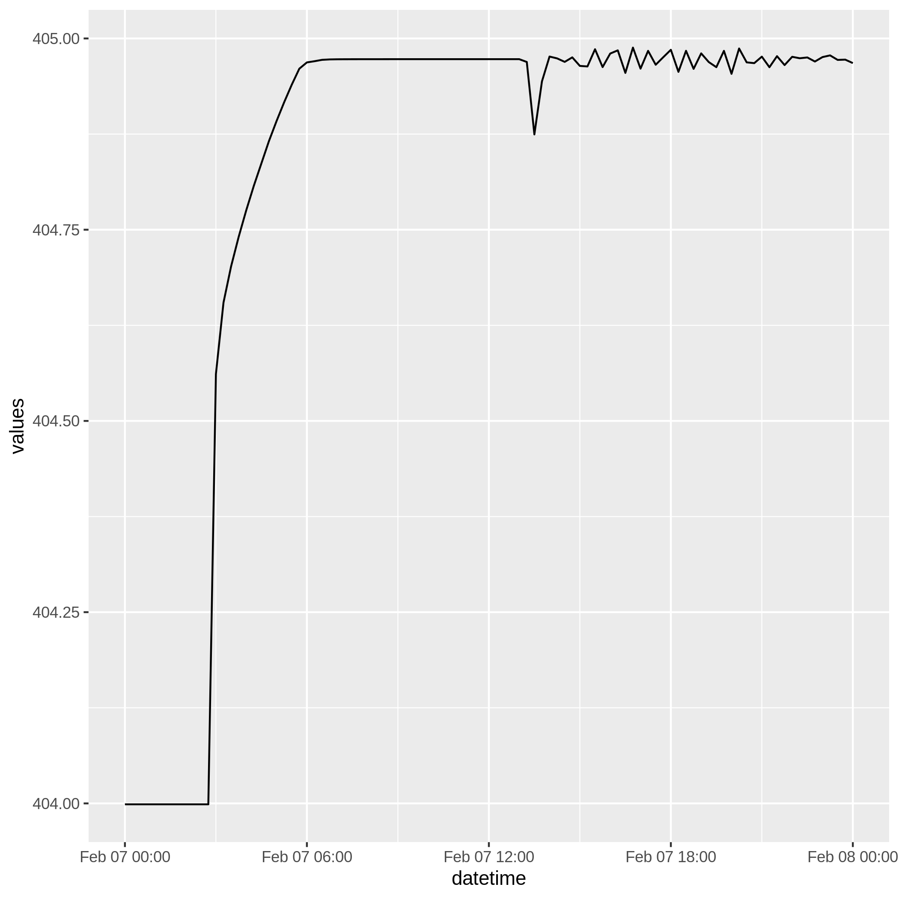

**DRAFT**

This article documents a set of solutions for different types of queries 
carried out on output from 2d hec-ras models. 

Most of these recipes will make use of **dplyr**, **purrr** as well as **ggplot2** and **plotly** for visualizations. Make sure these are installed before running examples.


## Read and Explore 

```{r eval=FALSE}
library(hecr)
h <- hec_file("../inst/examples/LowerDeerCreek_2018.p10.hdf")

print(h)

# A hec object----
# Plan File: LowerDeerCreek_2018.p10 
# Plan Name: Existing_LidarCalib_20180830 
# Geom Name: LowerDeerCreek_2018.g13 
# Out Inteval: 15MIN 
```

#### Glimpse at HDF Structure

```{r eval=FALSE}
tree(h)

# *Group:  Event Conditions 
# 	|
# 	-- Unsteady 
# 
# *Group:  Geometry 
# 	|
# 	-- 2D Flow Area Break Lines 
# 	|
# 	-- 2D Flow Areas 
# 	|
# 	-- Boundary Condition Lines 
# 	|
# 	-- Land Cover (Manning's n) 
# 	|
# 	-- River Bank Lines 
# 	|
# 	-- River Edge Lines 
# 	|
# 	-- River Flow Paths 
# 	|
# 	-- River Stationing 
# 	|
# 	-- Structures 
# 
# *Group:  Plan Data 
# 	|
# 	-- Plan Information 
# 	|
# 	-- Plan Parameters 
# 
# *Group:  Results 
# 	|
# 	-- Summary 
# 	|
# 	-- Unsteady 
```

You can glimpse deeper into the structure by passing the `depth` value to `tree()`. This is a nice utility to have, but for in depth exploration we 
recommend using **HDFView** available from the [HDF Group](https://www.hdfgroup.org/). 


### hdf5r 

The HDF backend for the package is provided through `hdf5r`. A user is able to 
explore using the `hdf5r` API by exposing the HDF5 object:

```{r eval=FALSE}
# h is still the 'hec-file' object from above
hdf_obj <- h$object

print(hdf_obj)

# Class: H5File
# Filename: /home/emanuel/Projects/hecr/inst/examples/LowerDeerCreek_2018.p10.hdf
# Access type: H5F_ACC_RDONLY
# Attributes: File Type, Units System, File Version, Projection
# Listing:
#              name  obj_type dataset.dims dataset.type_class
#  Event Conditions H5I_GROUP         <NA>               <NA>
#          Geometry H5I_GROUP         <NA>               <NA>
#         Plan Data H5I_GROUP         <NA>               <NA>
#           Results H5I_GROUP         <NA>               <NA>
```

Learn more about [hdf5r here](https://github.com/hhoeflin/hdf5r)

The rest of this article focuses on common queries.

## One plan one coordinate

The most basic query is one coordinate and one plan. There is no additional 
manipulation of `hec_two()` to make this query happen.

```{r eval=FALSE}
coord <- c(6570468.12123, 1881034.38489)
data <- hec_two(h, coord)

glimpse(data)

# Observations: 97
# Variables: 8
# $ datetime         <dttm> 2018-02-07 00:00:00, 2018-02-...
# $ plan_id          <chr> "Existing_LidarCalib_20180830"...
# $ plan_file        <chr> "LowerDeerCreek_2018.p10", "Lo...
# $ time_series_type <chr> "Water Surface", "Water Surfac...
# $ hdf_cell_index   <dbl> 445700, 445700, 445700, 445700...
# $ xin              <dbl> 1, 1, 1, 1, 1, 1, 1, 1, 1, 1, ...
# $ yin              <dbl> 2, 2, 2, 2, 2, 2, 2, 2, 2, 2, ...
# $ values           <dbl> 196.020980834961, 196.02098083...
```

The structure of the data is as follows:

|Column Nmae      |Description                                                         |
|:----------------|:-------------------------------------------------------------------|
|datetime         |a datatime object with date and time of record                      |
|plan_id          |a string with the name of the plan                                  |
|plan_file        |a string with the name of file queried from                         |
|time_series_type |the time series that was queried                                    |
|hdf_cell_index   |the cell index from the hdf file that was chosen for the coordinate |
|xin              |the corresponding x-coordinate supplied                             |
|yin              |the corresponding y-coordinate supplied                             |
|values           |the value of the time series                                        |

We can plot this data using ggplot2

```{r eval=FALSE}
library(ggplot2)
data %>% ggplot(aes(datetime, values)) + geom_line()
```



## One plan multiple coordinates

To query multiple coordinates out of the hdf file, simply provide a matrix, or an even
length vector of coordinates. The matrix must be *mx2* here *m* is the number of coordinates and 2 is the *x* and *y* coordinates (in that order). There is no limit on *m*. The other option is a vector of pairs of
coordinates, therefore of even length. We currently support vector since we plan to integrate clipboard
compatability in the near future. 

```{r eval=FALSE}
coords <- c(6570468.12123,	1881034.38489,
            6570186.03222,	1880216.19001,
            6570167.9381,	1879820.21836,
            6570141.81282,	1879703.42988,
            6570114.02745,	1879601.38152,
            6570108.19281,	1879582.69751,
            6569969.28791,	1879291.13936
)

data <- hec_two(h, coords)
```

## One Plan, mutiple coodinates for one timestamp (Profile Line)

## Multiple plans, multiple coordinates for one timestamp (Profile Lines)


