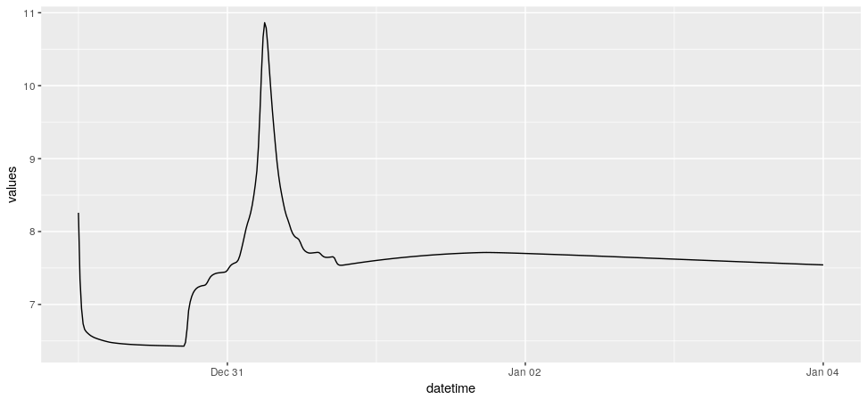
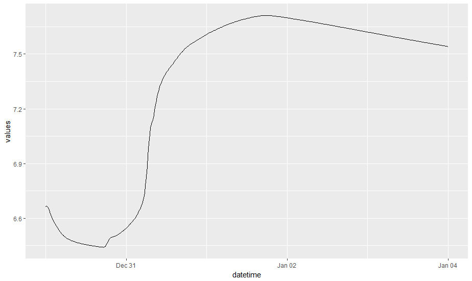
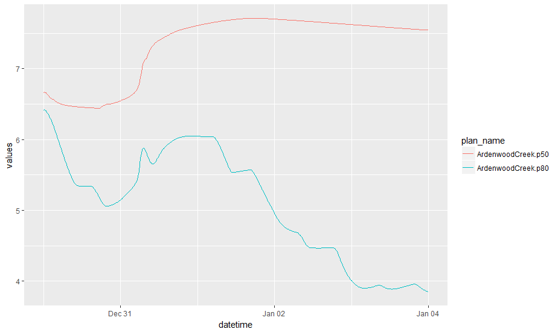

An R package for interacting with hdf5 files resulting from HEC-RAS 
model runs. `hecr` uses the `hdf5r` package and wraps around it functions that enable 
a user to quickly query out desired data in a tidy dataframe format.

## Installation 

The install requires `devtools`, you can install with `install.packages("devtools")`.
With `devtools` installed, you can install `hecr` with:

```r 
devtools::install_github("flowwest/hecr")
```

Installing hecr will install as dependencies: hdf5r, dplyr, purrr, and config. If detected
on the system these will not install, but an update might be required. The latest
versions of both purrr and dplyr are required for hecr to function properly.

## Usage 

The main goal of hecr is to streamline and automate the process of obtaining 
and analyzing output data from plan hdf files created from HEC-RAS unsteady 
simulation model runs. The hecr package provides an interface for obtaining data 
from 1-D cross sections and 2-D point locations and profiles at multiple time 
series or a single timestep. 

Below we walk through simple examples. More complex examples and real world
applications can be found in the [Tutorial (Coming Soon)](#)

## One-Dimensional Domain Queries

### 1-D Timeseries Output for a Single Plan

The user must provide the 1-D river cross-section name(s) as defined in the model.
A simple example is shown below:

```r
# load in the library
library(hecr)

# first read in the plan hdf file using the hec_file function
f <- hecr::hec_file("inst/raw-data/ArdenwoodCreek.p50.hdf")

print(f) # to view details of what was read

# extract timeseries output at a 1-D cross-section using the extract_ts1
water_surface <- hecr::extract_ts1(f, station_name = 6863.627, ts_type = "Water Surface")

# A list of all cross sections from any hdf file can be generated
cross_sections_in_model <- hecr::get_xs_river_stations(f)

# plot
water_surface %>% ggplot(aes(datetime, values, color = plan_name)) + geom_line()

```



The output data has been transformed to a tidy format and plotted
using ggplot. This is quite an improvement over using the RAS Mapper interface, 
which can often run into memory problems when generating profile data. Additionally,
once the R code has been defined, changes to the plans and model output can be 
read in, plotted, and other analyses performed at the push of a button.

An even more more powerful aspect of hecr is revealed when analysis requires
querying multiple plans at multiple locations within the model domain. 

### 1-D Timeseries Output for Multiple Plans

In this example, we read in a collection of hdf files. This can be accomplished
using the same `hec_file()` function, but this time supply it a directory 
containing the hdf files we are interested in. 

```r
# path to directory with hdf files we wish to query on
f <- hecr::hec_file("inst/raw-data/")

water_surface <- hecr::extract_ts1(f, station_name = 6863.627, ts_type = "Water Surface")

# plot
water_surface %>% ggplot(aes(datetime, values, color = plan_name)) + geom_line()
```


 
Once again the data is in a tidy form, and so it works great with ggplot or plotly.

If a subset of hdf files from the directory is desired, plan numbers can be 
supplied as a numeric vector to the parameter `plan_numbers` in the `hec_file` 
function.

```r
# query in this directory but only hdf files associated with plans 50, 60, 70
f <- hecr::hec_file("inst/raw-data", plan_numbers=c(50, 60, 70))
```

```r
print(z)

# A hec collection with 3 item(s)
# Files in collection
#  name: raw-data//ArdenwoodCreek.p50.hdf
#  name: raw-data//ArdenwoodCreek.p60.hdf
#  name: raw-data//ArdenwoodCreek.p70.hdf
```

*Developing a 1-D Long Profile* 

Creating a 1-D profile requires extracting output at all 1-D cross-sections
at a particular moment in time. This can be accomplished by using `all_cross_sections` 
and the `timestamp` argument in the `extract_ts1` function as shown below. 

```r

z <- extract_ts1(f, all_cross_sections, timestamp="2005-12-30 02:00:00")
```

As a result, hecr returns output at the `timestamp` value at each of the cross-sections
in the model:

```
#EMANUEL:  REPLACE THIS WITH A LONG PROFILE TIBBLE
# A tibble: 1 x 6
             datetime                         plan_id river_name reach_name cross_section           values
               <dttm>                           <chr>      <chr>      <chr>         <chr>            <dbl>
1 2005-12-30 10:00:00 Q100_ExistBaseline_Wet_20170307 AlamedaCk2   Upstream      44930.9* 27.0153141021729
```

The output can be plotted to reveal the long profile.

**EMANUEL:  CREATE A FIGURE AND PUT IT HERE PLEASE - one long profile**

Of course, this can be expanded to include multiple plans:

**EMANUEL:  CREATE A FIGURE AND PUT IT HERE PLEASE - multiple long profiles**

## Two-Dimensional Domain Querries

The same queries can be done for 2-D portions of the model. Examples
similar to those shown above are provided in this section for the 2-D model domain. 

*2-D Timeseries Output at a Single Point for a Single Plan* 

For 2-D model output, the user must provide a set of coordinates defining 
the point at which results are desired. Coordinates can be extracted from 
RAS Mapper by double-clicking the ruler tool **(EMANUEL: HOW DO I ADD A JPG?)** in 
the 2-D model domain. 

```r
# read in file
f <- hecr::hec_file("inst/raw-data/ArdenwoodCreek.p50.hdf")

# set up coordinate to query for
coord <- c(6103057.45033481, 2027049.43985547)

x <- hecr::extract_ts2(f, xy = coord, ts_type = "Water Surface")

# tidy data
print(x3)
```

`hecr` uses the distance formula to locate the nearest cell center point and 
reports output for that cell. The resulting tibble records the cell index that
was selected.

```
# A tibble: 481 x 5
              datetime          plan_name time_series_type hdf_cell_index           values
                <dttm>              <chr>            <chr>          <dbl>            <dbl>
 1 2005-12-30 00:00:00 ArdenwoodCreek.p50    Water Surface          18296 6.66271018981934
 2 2005-12-30 00:15:00 ArdenwoodCreek.p50    Water Surface          18296 6.66538572311401
 3 2005-12-30 00:30:00 ArdenwoodCreek.p50    Water Surface          18296 6.66436624526978
 4 2005-12-30 00:45:00 ArdenwoodCreek.p50    Water Surface          18296 6.65778636932373
 5 2005-12-30 01:00:00 ArdenwoodCreek.p50    Water Surface          18296 6.64651870727539
 6 2005-12-30 01:15:00 ArdenwoodCreek.p50    Water Surface          18296 6.63137197494507
 7 2005-12-30 01:30:00 ArdenwoodCreek.p50    Water Surface          18296 6.61756515502930
 8 2005-12-30 01:45:00 ArdenwoodCreek.p50    Water Surface          18296 6.60669612884521
 9 2005-12-30 02:00:00 ArdenwoodCreek.p50    Water Surface          18296 6.59691762924194
10 2005-12-30 02:15:00 ArdenwoodCreek.p50    Water Surface          18296 6.58782863616943
# ... with 471 more rows
```

Plotting 

```r
x %>% ggplot(aes(datetime, values)) + geom_line()
```




*2-D Timeseries Output at a Single Point for Multiple Plans* 

Much like the one dimensional part, we can set up a collection of hdf files and query all 
of them for a given coordinate: 

```r

# create a collection of plan hdf files
f <- hecr::hec_file("inst/raw-data/", plan_numbers=c(50, 80))

# query output from all files defined in the collection
x <- hecr::extract_ts2(f, coord, ts_type = "Water Surface")

# plot 
x %>% ggplot(aes(datetime, values, color = plan_name)) + geom_line()
```



*2-D Timeseries Output at Multiple Coordinates Across Multiple Plans*

Multiple timeseries output can be queried at multiple locations for multiple plans.
`extract_ts2` will accept sets of ordered pairs as a vector or a matrix. 

```r
# create a matrix of coordinates of interest
m <- matrix(c(6099816.76262168,	2030896.94257798,
              6099866.76262168,	2030896.94257798,
              6099916.76262168,	2030896.94257798,
              6099966.76262168,	2030896.94257798,
              6100016.76262168,	2030896.94257798,
              6100166.76262168,	2030896.94257798,
              6100216.76262168,	2030896.94257798,
              6100266.76262168,	2030896.94257798,
              6100316.76262168,	2030896.94257798,
              6100366.76262168,	2030896.94257798,
              6106316.76262168,	2030896.94257798,
              6106366.76262168,	2030896.94257798), ncol = 2, byrow = TRUE)

# query the hdf files
x <- hecr::extract_ts2(f, xy=m, ts_type="Water Surface")

# plot 
x %>% 
  ggplot(aes(datetime, values, color=as.character(hdf_cell_index))) + 
  geom_line() + 
  facet_grid(~plan_name)
```


*Generating 2-D Profiles* 

Creating a 2-D profile requires extracting output at multiple 2-D points along
a line at a particular moment in time. This can be accomplished by first defining
a vector of the coordinates of the vertices of the line and defining the time using 
the `timestamp` argument in the `extract_ts2` function as shown below. 

```r

coords <- c(6110301.58805,2028896.40849, 6110287.20678,2028885.96397, 6110269.85803,2028873.3643, 6110264.59904,2028869.54491, 6110247.00638,2028858.67421, 6110244.08893,2028856.87148, 6110231.15183,2028848.8775, 6110224.43947,2028844.72986, 6110209.96868,2028834.58642, 6110199.45371,2028826.78249, 6110196.28656,2028824.09402, 6110191.85478,2028820.70417, 6110187.42375,2028817.34818, 6110182.97731,2028814.0131, 6110178.51535,2028810.69868, 6110174.03766,2028807.40535, 6110169.54495,2028804.13328, 6110165.03688,2028800.88176, 6110160.51302,2028797.65162, 6110155.97486,2028794.44311, 6110151.42118,2028791.25526, 6110146.85268,2028788.08912, 6110142.2695,2028784.94456, 6110137.67217,2028781.82137, 6110133.05921,2028778.71945, 6110128.43272,2028775.63987, 6110123.79134,2028772.58107, 6110119.1354,2028769.5448, 6110114.46591,2028766.53019, 6110109.78197,2028763.53721, 6110105.08369,2028760.56657, 6110100.37253,2028757.61825, 6110095.64715,2028754.69139, 6110090.9076,2028751.7869, 6110086.15488,2028748.90486, 6110081.38887,2028746.04519, 6110076.6097,2028743.20756, 6110071.81669,2028740.39231, 6110067.01105,2028737.59977, 6110062.1923,2028734.82963, 6110057.35101,2028732.07681, 6110053.30357,2028729.92315, 6110049.2826,2028727.75462, 6110045.27383,2028725.56308, 6110041.27674,2028723.34887, 6110037.29212,2028721.11244, 6110033.32074,2028718.85403, 6110029.3684,2028716.57651, 6110025.41598,2028714.26945, 6110021.48292,2028711.94411, 6110017.5634,2028709.59692, 6110013.6567,2028707.22734, 6110009.76336,2028704.83595, 6110005.88401,2028702.42312, 6110002.01771,2028699.98784, 6109998.16555,2028697.53146, 6109994.32707,2028695.05314, 6109990.50231,2028692.55334, 6109986.69178,2028690.03219, 6109982.89581,2028687.49012, 6109979.11464,2028684.92631, 6109975.3465,2028682.34065, 6109971.59352,2028679.73492, 6109967.85553,2028677.10758, 6109964.13216,2028674.45968, 6109960.42432,2028671.79088, 6109956.73121,2028669.10081, 6109953.05306,2028666.39041, 6109949.39005,2028663.65892, 6109945.74237,2028660.90747, 6109942.1108,2028658.13551, 6109938.49438,2028655.34312, 6109934.89408,2028652.5303, 6109931.30905,2028649.69723, 6109927.7404,2028646.84425, 6109924.18801,2028643.97153, 6109920.6516,2028641.07808, 6109917.12323,2028638.1592, 6109913.08422,2028634.92309, 6109909.03197,2028631.71063, 6109904.96427,2028628.5187, 6109900.88029,2028625.3468, 6109896.77982,2028622.19563, 6109892.66392,2028619.0655, 6109888.53211,2028615.95627, 6109884.38493,2028612.86811, 6109880.22195,2028609.80062, 6109876.04398,2028606.75431, 6109871.85017,2028603.72873, 6109867.64094,2028600.72437, 6109863.41702,2028597.74221, 6109859.17861,2028594.7807, 6109854.9241,2028591.84027, 6109850.65541,2028588.92226, 6109846.3723,2028586.0255, 6109842.07467,2028583.15024, 6109837.76193,2028580.29653, 6109833.43503,2028577.46523, 6109829.09443,2028574.65544, 6109824.73923,2028571.86787, 6109820.37033,2028569.10182, 6109815.98675,2028566.35805, 6109811.58998,2028563.63666, 6109807.17958,2028560.93726, 6109802.7554,2028558.26033, 6109798.3179,2028555.60579, 6109793.86657,2028552.97335, 6109789.40235,2028550.36383, 6109784.9253,2028547.77693, 6109781.43789,2028545.78534, 6109780.43526,2028545.21276, 6109775.93208,2028542.67069, 6109772.40896,2028540.70553, 6109771.41634,2028540.15186, 6109767.23593,2028537.84467, 6109763.07207,2028535.51777, 6109758.91952,2028533.16909, 6109754.77661,2028530.7976, 6109750.65292,2028528.40783, 6109746.53732,2028525.99467, 6109742.43511,2028523.56055, 6109738.34574,2028521.10499, 6109734.26888,2028518.62809, 6109730.20522,2028516.13046, 6109726.1543,2028513.61099, 6109722.11629,2028511.07087, 6109718.09195,2028508.50993, 6109714.08109,2028505.92825, 6109710.08367,2028503.32499, 6109706.09931,2028500.70169, 6109702.12942,2028498.05737, 6109698.17292,2028495.39259, 6109694.23063,2028492.70726, 6109690.30201,2028490.00133, 6109686.38724,2028487.27493, 6109682.48717,2028484.52874, 6109678.60128,2028481.76176, 6109674.72991,2028478.97497, 6109670.8733,2028476.16789, 6109667.0309,2028473.34054, 6109663.20302,2028470.49361, 6109659.39085,2028467.62719, 6109655.59316,2028464.74012, 6109651.8102,2028461.83379, 6109648.0427,2028458.9078, 6109644.29108,2028455.96269, 6109640.55495,2028452.99797, 6109636.67688,2028449.87547, 6109632.77824,2028446.76978, 6109628.86361,2028443.68463, 6109624.93286,2028440.61993, 6109620.9856,2028437.57563, 6109617.02235,2028434.55221, 6109613.04376,2028431.55017, 6109609.0499,2028428.56872, 6109605.03961,2028425.60783, 6109601.01415,2028422.66827, 6109596.97349,2028419.75002, 6109592.91734,2028416.85277, 6109588.84632,2028413.97692, 6109584.75995,2028411.1225, 6109580.65899,2028408.28935, 6109576.54341,2028405.47811, 6109572.41278,2028402.68783, 6109568.26739,2028399.91992, 6109564.10834,2028397.17367, 6109559.9343,2028394.44887, 6109555.74556,2028391.74594, 6109551.54339,2028389.06558, 6109547.32743,2028386.40702, 6109543.09736,2028383.77083, 6109538.85373,2028381.15637, 6109534.59572,2028378.56444, 6109530.3252,2028375.99502, 6109526.0403,2028373.44759, 6109521.74221,2028370.9228, 6109517.43161,2028368.42099, 6109513.10741,2028365.94143, 6109508.77062,2028363.4848, 6109504.42118,2028361.05092, 6109500.0647,2028358.6427, 6109495.84649,2028356.25804, 6109491.63615,2028353.84871, 6109487.44608,2028351.42184, 6109485.31854,2028350.17444, 6109483.26489,2028348.97036, 6109479.09588,2028346.49722, 6109474.94045,2028344.00273, 6109470.79814,2028341.48643, 6109466.66864,2028338.94851, 6109462.55271,2028336.38885, 6109458.45005,2028333.80792, 6109454.36059,2028331.20542, 6109450.28546,2028328.58201, 6109449.21837,2028327.88724, 6109446.22357,2028325.93739, 6109442.17554,2028323.27122, 6109438.14198,2028320.58434, 6109434.12206,2028317.8763, 6109430.1169,2028315.14733, 6109426.12546,2028312.39701, 6109422.14778,2028309.62615, 6109418.18559,2028306.83541, 6109414.23837,2028304.02342, 6109410.30472,2028301.19052, 6109406.3866,2028298.33765, 6109402.48368,2028295.46425, 6109398.59555,2028292.56995, 6109394.72204,2028289.65615, 6109390.86449,2028286.72183, 6109387.0219,2028283.76729, 6109383.19502,2028280.79285, 6109379.38342,2028277.79867, 6109375.58787,2028274.78478, 6109371.807,2028271.75, 6109368.47277,2028269.06381, 6109365.11979,2028266.39589, 6109361.75182,2028263.74791, 6109358.3674,2028261.11967, 6109354.96781,2028258.51213, 6109351.5526,2028255.92439, 6109348.12166,2028253.35727, 6109344.67642,2028250.81101, 6109341.21561,2028248.28466, 6109337.73979,2028245.77931, 6109334.24889,2028243.29424, 6109330.74324,2028240.83044, 6109327.22372,2028238.38788, 6109323.68896,2028235.96536, 6109320.13944,2028233.56445, 6109316.57694,2028231.18523, 6109312.99962,2028228.82646, 6109309.40805,2028226.48943, 6109305.80347,2028224.17393, 6109302.18424,2028221.87957, 6109298.55195,2028219.60706, 6109294.90633,2028217.35622, 6109291.24725,2028215.12696, 6109287.57483,2028212.91951, 6109283.88889,2028210.73395, 6109280.19034,2028208.57083, 6109276.47956,2028206.42962, 6109272.75605,2028204.31033, 6109269.01888,2028202.21286, 6109265.26993,2028200.13819, 6109261.50898,2028198.08603, 6109257.73602,2028196.05621, 6109253.94612,2028194.04628, 6109250.476,2028192.28305, 6109247.02711,2028190.50209, 6109244.98723,2028189.43238, 6109243.58983,2028188.69959, 6109240.16554,2028186.87463, 6109236.75173,2028185.02687, 6109233.35055,2028183.15743, 6109229.96233,2028181.26618, 6109226.58538,2028179.35185, 6109223.22658,2028177.41957, 6109219.87052,2028175.45924, 6109216.53135,2028173.47962, 6109213.20586,2028171.47886, 6109209.89385,2028169.45669, 6109206.59458,2028167.41255, 6109203.30835,2028165.34687, 6109200.03631,2028163.26057, 6109196.77787,2028161.15213, 6109193.53176,2028159.02272, 6109190.30188,2028156.87344, 6109187.08497,2028154.70158, 6109183.88137,2028152.50938, 6109180.69323,2028150.29683, 6109177.5198,2028148.06362, 6109174.36023,2028145.80904, 6109171.21546,2028143.53449, 6109168.08594,2028141.23957, 6109164.9714,2028138.92403, 6109161.87125,2028136.58797, 6109158.78672,2028134.23256, 6109155.71776,2028131.85664, 6109152.65758,2028129.45591, 6109148.91729,2028126.59653, 6109145.1641,2028123.7587, 6109141.39584,2028120.94098, 6109137.61307,2028118.14329, 6109133.81576,2028115.36593, 6109130.00361,2028112.60826, 6109126.17723,2028109.871, 6109122.33571,2028107.15356, 6109118.48066,2028104.45725, 6109114.61152,2028101.78055, 6109113.90317,2028101.29618, 6109110.72748,2028099.12461, 6109106.8302,2028096.4892, 6109102.91848,2028093.87441, 6109098.99374,2028091.28085, 6109095.05505,2028088.70712, 6109091.10208,2028086.15457, 6109087.34958,2028083.7595, 6109066.08244,2028068.98415, 6109038.86844,2028050.0772, 6109034.61506,2028047.12217, 6109029.76273,2028043.751, 6108901.15742,2027949.21207, 6108874.18982,2027933.78961, 6108850.23149,2027920.94239, 6108825.57871,2027909.48406, 6108808.2176,2027899.76184, 6108794.67593,2027892.81739, 6108787.03705,2027886.91461, 6108779.05093,2027877.53961, 6108760.64816,2027866.08128, 6108728.70371,2027851.49795, 6108707.52316,2027840.03961, 6108693.28705,2027831.01184, 6108670.37038,2027813.65072, 6108656.48149,2027802.53961, 6108645.02316,2027792.12295, 6108642.36166,2027790.12683, 6108622.80093,2027775.45628, 6108608.91205,2027761.22017, 6108589.12038,2027745.24795, 6108567.24538,2027733.78961, 6108545.7176,2027722.33128, 6108524.88427,2027711.56739, 6108504.74538,2027698.72017, 6108486.68982,2027684.48406, 6108471.41205,2027674.76184, 6108455.43982,2027663.99795, 6108441.89816,2027648.37295, 6108424.18982,2027638.3035, 6108406.82871,2027628.58128, 6108391.89816,2027620.59517, 6108379.74538,2027612.60906, 6108357.52316,2027595.24795, 6108339.81482,2027584.13684, 6108321.41205,2027572.6785, 6108311.3426,2027565.73406, 6108300.57871,2027558.44239, 6108281.82871,2027542.81739, 6108267.93982,2027531.35906, 6108258.91205,2027526.15072, 6108235.64816,2027511.91461, 6108211.3426,2027499.06739, 6108184.25927,2027490.03961, 6108162.73149,2027483.09517, 6108134.95371,2027474.76184, 6108124.18982,2027471.28961, 6108101.9676,2027460.87295, 6108073.49538,2027445.24795, 6108054.39816,2027433.78961, 6108041.20371,2027421.28961, 6108034.95371,2027415.38684, 6108019.67593,2027399.76184, 6107997.45371,2027388.65072, 6107972.45371,2027378.23406, 6107950.92593,2027373.02572, 6107932.17593,2027370.24795, 6107908.56482,2027369.20628, 6107882.87038,2027363.3035, 6107848.14816,2027350.8035, 6107830.43982,2027341.77572, 6107808.91205,2027323.37295, 6107790.85649,2027313.99795, 6107754.74538,2027293.16461, 6107736.3426,2027286.56739, 6107731.82871,2027286.56739, 6107721.06482,2027282.40072, 6107708.56482,2027279.27572, 6107692.24538,2027275.8035, 6107682.52316,2027272.6785, 6107671.06482,2027267.81739, 6107644.32871,2027258.78961, 6107639.89166,2027256.50386, 6107621.41205,2027246.98406, 6107595.02316,2027233.78961, 6107573.8426,2027224.41461, 6107568.63427,2027218.85906, 6107544.32871,2027204.27572, 6107524.18982,2027194.5535, 6107494.32871,2027183.09517, 6107464.81482,2027173.72017, 6107431.13427,2027162.26184, 6107423.49538,2027154.62295, 6107402.31482,2027138.3035, 6107387.03705,2027120.24795, 6107369.32871,2027107.74795, 6107347.10649,2027096.98406, 6107330.43982,2027095.24795, 6107309.60649,2027092.81739, 6107284.95371,2027092.81739, 6107271.75927,2027090.38684, 6107255.0926,2027086.22017, 6107236.68982,2027078.58128, 6107229.63802,2027074.90846, 6107220.02316,2027069.90072, 6107194.32871,2027059.13684, 6107178.00927,2027049.76184, 6107160.99538,2027036.22017, 6107145.7176,2027019.90072, 6107129.05093,2027005.66461, 6107099.88427,2026988.65072, 6107059.25927,2026970.59517, 6107001.9676,2026944.5535, 6106929.39816,2026914.69239, 6106916.89816,2026907.74795, 6106900.92593,2026896.98406, 6106889.12038,2026888.3035, 6106875.23149,2026882.40072, 6106863.07871,2026879.27572, 6106848.14816,2026872.33128, 6106826.00392,2026863.22754, 6106627.9604,2026779.58062, 6106608.42927,2026767.86181, 6106555.04388,2026748.33068, 6106487.33535,2026717.08074, 6106419.62715,2026688.4348, 6106362.33527,2026664.99751, 6106290.72091,2026633.74725, 6106241.24168,2026609.00779, 6106181.34581,2026579.06002, 6106103.22096,2026541.95051, 6105990.37375,2026494.2075, 6105926.35452,2026467.08058, 6105862.33529,2026443.20924, 6105759.2538,2026396.5512, 6105705.0003,2026369.42461, 6105657.25729,2026341.21273, 6105605.17406,2026318.42635, 6105554.1758,2026295.63965, 6105460.85971,2026262.00258, 6105389.24503,2026233.7907, 6105319.80061,2026202.3239, 6105267.71738,2026179.5372, 6105202.61318,2026146.9851, 6105116.89255,2026103.5823, 6105030.08728,2026066.68998, 6104969.32329,2026038.47842, 6104882.51769,2026002.67108, 6104834.77468,2025983.13962, 6104774.01069,2025938.65185, 6104736.03341,2025914.78051, 6104695.88585,2025903.92981, 6104666.58899,2025891.99381, 6104637.29213,2025882.22841, 6104594.97431,2025868.12247, 6104553.74178,2025862.69695, 6104461.51066,2025843.16582, 6104405.08722,2025831.23015, 6104345.4082,2025822.54939, 6104278.13406,2025819.29415, 6104222.79559,2025821.46442, 6104126.22426,2025836.65534, 6104073.05573,2025837.74031, 6103977.5697,2025861.61198, 6103916.80604,2025876.80289, 6103811.55428,2025911.52527, 6103758.38576,2025933.22667, 6103699.79204,2025965.77877, 6103639.02806,2025997.24557, 6103585.85985,2026046.07388, 6103531.60635,2026100.32738, 6103495.79901,2026135.04942, 6103444.80075,2026171.94174, 6103394.88747,2026204.49384, 6103356.91018,2026239.21621, 6103314.59235,2026285.87425, 6103261.42382,2026365.08407, 6103209.34059,2026460.57043, 6103165.93779,2026538.69527, 6103132.30072,2026626.58584, 6103096.49338,2026754.62397, 6103072.62171,2026866.38622, 6103065.02625,2026983.57365, 6103057.43079,2027043.25266, 6103038.98464,2027136.56842, 6102990.15665,2027251.58591, 6102942.41363,2027366.60339, 6102910.94651,2027474.02509, 6102878.39441,2027566.25621, 6102855.60803,2027647.63629, 6102838.24685,2027718.16568, 6102801.35453,2027825.58771, 6102767.71746,2027904.79785, 6102734.08006,2027976.41221, 6102716.7192,2028019.81501, 6102713.46396,2028075.15348, 6102717.80418,2028156.5339, 6102709.12375,2028234.65874, 6102713.46396,2028327.97483, 6102722.14439,2028380.05806, 6102756.86676,2028487.48009, 6102777.48286,2028537.39337, 6102774.22762,2028591.64655, 6102750.35628,2028633.96437, 6102687.42235,2028668.68675, 6102647.27479,2028717.51473, 6102590.85102,2028741.3864, 6102501.87547,2028758.74726, 6102420.49506,2028751.1518, 6102369.4968,2028740.3011, 6102320.66882,2028733.79095, 6102265.33034,2028728.36543, 6102215.41706,2028694.72836, 6102180.69469,2028660.00599, 6102160.07859,2028630.70913, 6102109.08033,2028611.178, 6102042.89083,2028604.66752, 6101947.4048,2028619.85843, 6101902.91703,2028640.47486, 6101877.96038,2028677.36717, 6101838.8978,2028714.25949, 6101810.68624,2028751.1518, 6101787.89954,2028765.25775, 6101774.8789,2028795.6399, 6101771.62365,2028837.9574, 6101786.81457,2028880.27523, 6101802.00548,2028938.86895, 6101812.85618,2028979.01651, 6101817.1964,2029044.12071, 6101807.431,2029078.84275, 6101785.7296,2029122.24555, 6101744.49674,2029188.43472, 6101681.56281,2029256.79417, 6101592.58727,2029390.25781, 6101565.46035,2029407.619, 6101531.82328,2029416.29942, 6101489.50545,2029414.12948, 6101440.67746,2029409.78894, 6101414.63585,2029411.95921, 6101371.23305,2029415.21445, 6101347.36138,2029426.06515, 6101324.57501,2029443.42634, 6101305.04388,2029449.9365, 6101275.74702,2029455.36201, 6101243.19492,2029467.29768, 6101214.98303,2029480.31865, 6101183.51591,2029505.2753, 6101144.45332,2029551.93301, 6101126.00716,2029579.05993, 6101102.13582,2029623.5477, 6101078.26415,2029672.37601, 6101052.22253,2029710.3533, 6101029.43616,2029747.24561, 6101005.56449,2029798.24387, 6100976.26763,2029851.4124, 6100936.12008,2029902.41066, 6100895.97252,2029954.49389, 6100839.54907,2030017.42781, 6100812.42216,2030055.40543, 6100779.87006,2030105.31872, 6100714.76586,2030183.44356, 6100644.23647,2030260.48343, 6100599.7487,2030291.95056, 6100549.83541,2030337.5233, 6100542.23996,2030378.75616, 6100546.58017,2030425.4142, 6100555.2606,2030480.75268, 6100575.87703,2030515.47472, 6100600.83367,2030548.02682, 6100621.4501,2030584.91913, 6100629.04556,2030623.98172, 6100605.17389,2030643.51285, 6100569.36654,2030660.87403, 6100546.58017,2030692.34116, 6100538.98471,2030717.29781, 6100545.4952,2030818.20935, 6100569.36654,2031002.67092)

z <- extract_ts2(f, coords, timestamp="2005-12-30 02:00:00")
```

As a result, hecr returns output at the `timestamp` value at each of the points
specified:

```
#EMANUEL:  REPLACE THIS WITH A LONG PROFILE TIBBLE

# A tibble: 1 x 6
             datetime                         plan_id river_name reach_name cross_section           values
               <dttm>                           <chr>      <chr>      <chr>         <chr>            <dbl>
1 2005-12-30 10:00:00 Q100_ExistBaseline_Wet_20170307 AlamedaCk2   Upstream      44930.9* 27.0153141021729
```

The output can be plotted to reveal the long profile.

**EMANUEL:  CREATE A FIGURE AND PUT IT HERE PLEASE - one long profile**

Of course, this can be expanded to include multiple plans:

**EMANUEL:  CREATE A FIGURE AND PUT IT HERE PLEASE - multiple long profiles**

## MetaData 

A lot of current development is associated with capturing all the required metadata 
from hdf files. The `hec_metadata` function reports metadata for the plan hdfs
read in with `hec_file()`. 

```r
meta <- hecr::hec_metadata(f)
```
Fields returned by the function include plan ID, plan name, plan file name, and
time window of the plan run.

```
# A tibble: 1 x 4
                          plan_id                       plan_name
                            <chr>                           <chr>
1 Q100_ExistBaseline_Wet_20170307 Q100_ExistBaseline_Wet_20170307
# ... with 2 more variables: plan_file <chr>, time_window <chr>
```

Every dataframe obtained with one of the `extract_*` functions has attached to it 
a reference to the collection that created it. This allows for easy creation of 
helper pipe functions like `append_meta()` when we want to attach extra columns to 
a given dataframe 

```r
# x is an already existing dataframe from calling extract_ts2
# add metadata columns to the dataframe
y <- x %>% append_meta() 
```

Future releases will make extensive use of this type of functionality. 


